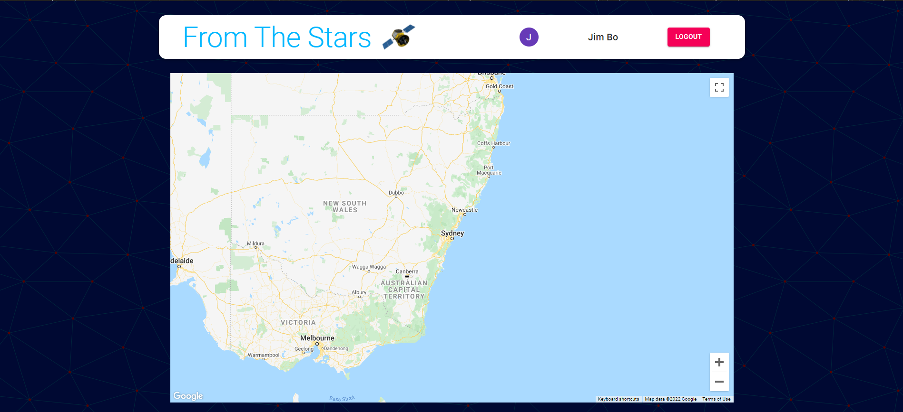
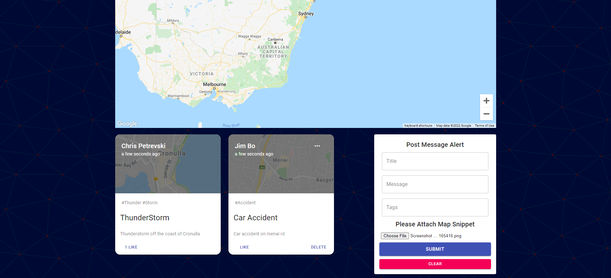
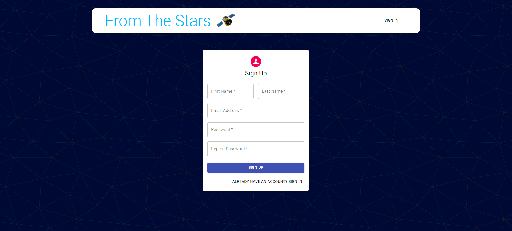

# FromTheStars
From The Stars - MERN Stack Single-Page Application

## Project Requirements

Your group will use everything you’ve learned throughout this course to create a MERN stack single-page application that works with real-world data to solve a real-world challenge, with a focus on data and user demand. This project will provide you with the best opportunity to demonstrate your problem-solving skills, which employers will want to see during interviews. Once again, the user story and acceptance criteria will depend on the project that you create, but your project must fulfill the following requirements:

## FromTheStars Project

I have created an app where users can post a warning message live to a UI to connect with other users and share their information. The app allows the user to take a snippet of the area from a google maps and post it along with the message to get a better visual on the area they are reffering too. Along with JWT Authentification to allow for better security and also not be able to edit other user posts. 

## User Story

```md
AS A user 
I WANT to be able to post about dangers around my area
SO THAT I can keep other users updated and also keep myself updated
```

## Technologies Used

NodeJS, ReactJS, ExpressJs, MongoDB, Material UI, GoogleMaps API, Dotenv, JWT, Bcrypt, Moment, Redux, React Router Dom, AXIOS, React FileBase 64

## Installation

Run: 
```
npm i && npm start
```
for both client and server side. Create a .env file and copy the .env.example file for instructions

# Demo


<br />
<br />

<br />
<br />


## Links

<a href="https://github.com/CPetrevski/FromTheStars">GitHub Repo</a> 
<br />
<br />
<a href="https://infinite-sands-88122.herokuapp.com/">Live Heorku App</a> 
<br />
<br />
<a href="https://docs.google.com/presentation/d/1cIBwTk2Wuw38VrPSS7mV-rc6ZMewKB911yXKOjbCXCE/edit?usp=sharing">Slideshow</a> 